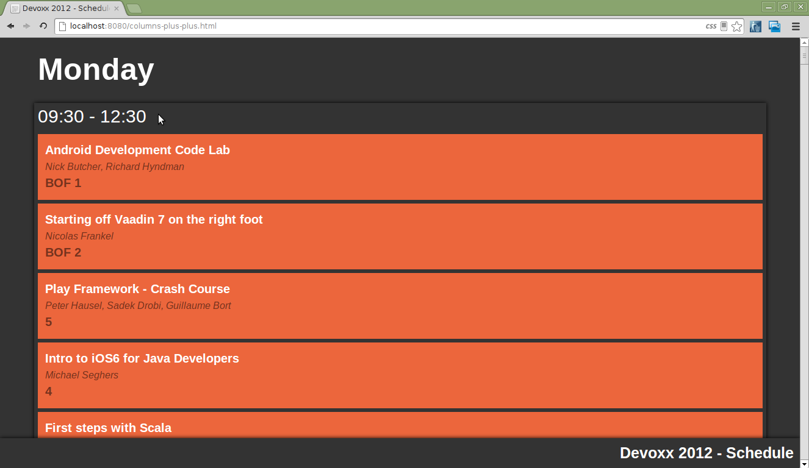
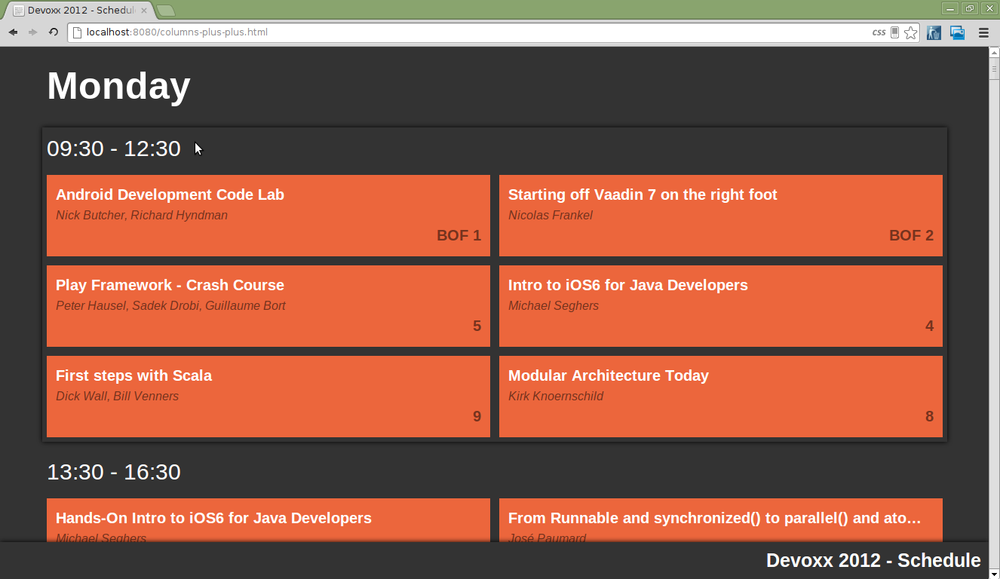

<!-- title : Devoxx Schedule -->
<!-- author : Hubert SABLONNIÈRE -->
<!-- description : Complete overview of the first lessons about CSS, JavaScript, DOM, Events and AJAX... -->
<!-- keywords : css, javascript, dom, events, ajax -->

<link href="../css/bootstrap.min.css" rel="stylesheet">
<link href="../css/bootstrap-responsive.min.css" rel="stylesheet">
<link href="../css/theme-2012-common.css" rel="stylesheet">
<link href="../css/theme-2012-lab.css" rel="stylesheet">
<link href="../css/hljs-github.css" rel="stylesheet">

# Devoxx Schedule

<!-- toc -->


Today, we'll build the schedule for the Devoxx Conference. Here's the instructions for each exercise :

* Understand the context.
* Follow the steps and rules carefully.
* Verify that you've created the appropriate files.

#### Introduction

This lab requires AJAX support. Because of that we'll need an HTTP server. We'll be using Node.js just like we did for the M.Y.O.K.O.M. lab.

Go to the root directory and enter this command :

```
node devoxx-server.js
```

You should be able to browse this page : http://localhost:8080/columns-plus-plus.html

Bon courage...

## Columns++

### Learning goals

1. Know how the box model works
1. Know how clear/float works

### Context

Have a look at http://localhost:8080/columns-plus-plus.html. It should look like this :



After completing the steps, it should look like this :



### Steps

* Before changing the CSS, note that when you hover the `.schedule-from-to` with the mouse, a box shadow is displayed.
* Use the already existing file [public/columns-plus-plus.css](http://localhost:8080/columns-plus-plus.css).
* Add some code to put the `.schedule-talk-room` name on the right without using floats!
* Change the width of the `.schedule-talk` so you'll be able to put two of them on the same line.
* Because of the box-model, `width: 50%` will be too much. Comment in details how you calculated the width value that works.
* Now that your `.schedule-talk` have the correct width, you can float them so they can be displayed in two columns.
* Now that you changed the floats inside `.schedule-from-to` children elements, the box-shadow isn't displayed properly. Use the "clearfloat" technique to fix the problem.

### Rules

* You **CANNOT** use floats for the `.schedule-talk-room` on the right.
* Your CSS **MUST** be valid!!
* You **MUST** have a similar result as the image.

### Files to edit

<!-- .deliveries -->
* public/columns-plus-plus.css

## First things first

### Learning goals

1. Know how to build simple JavaScript

### Context

In the other exercises, we'll use simple utility functions. We'll implement them right now.

You can browse this page http://localhost:8080/utils-testing.html and use the console to test your functions.

### Steps

* Have look at [public/devoxx-core-utils.js](http://localhost:8080/devoxx-utils.js). You'll see functions on the `utils` property of the global `dvx` object.
* You can notice that they don't do what the comments say.

#### Capitalize

* Replace the code in the `dvx.utils.capitalize` function with a working implementation.
* Use the comments to understand how the function should behave.

#### Leading zero

* Replace the code in the `dvx.utils.leadingZero` function with a working implementation.
* Use the comments to understand how the function should behave.

#### Format time

* Replace the code in the `dvx.utils.formatTime` function with a working implementation.
* Use the comments to understand how the function should behave.
* You'll need to convert a string representation of a date to a date object and extract the hours and minutes.
* If you need examples for string representation of dates, have look at [public/devoxx-schedule.json](http://localhost:8080/devoxx-schedule.json) and use `fromTime` or `toTime`.

#### Compare talks

* Replace the code in the `dvx.utils.compareTalks` function with a working implementation.
* Use the comments to understand how the function should behave.
* You'll need to compare `fromTime` (and `toTime` when needed). Be careful, these properties are strings, you'll need to convert them to date just like you did for `dvx.utils.formatTime`.
* If you need examples for talk objects, have look at [public/devoxx-schedule.json](http://localhost:8080/devoxx-schedule.json).

### Rules

* You **CAN** only modify inside of the functions. The rest of the code **CANNOT** change.
* You **CANNOT** change the parameters of the functions.

### Files to edit

<!-- .deliveries -->
* public/devoxx-utils.js

## Day by day...

### Learning goals

1. Know how to use the DOM to display informations.

### Context

In this exercise we'll build the schedule page day by day and talk by talk.

### Steps

#### Preparation

* Have a look at http://localhost:8080/day-by-day.html, it doesn't display the schedule yet.
* Parse the JSON string `dvx.schedule.json` and try to figure out how it is structured. Use console.log and/or the JavaScript debugger.
* Start by modifying the empty file [public/devoxx-schedule-by-variable.js](http://localhost:8080/devoxx-schedule-by-variable.js).
* Add some code to call `dvx.schedule.display` function and give it the parsed object.
* Your code in this file should be very simple : 1 line. It's normal.

#### Titles

* Modify the title of the document using the parsed object title property.
* Modify the `.app-title` using the parsed object title property.

#### Days

* Have a look at [public/devoxx-schedule-display.js](http://localhost:8080/devoxx-schedule-display.js), it contains an empty function.
* Add some code into the empty function to iterate over the different days.
* For each day, create a `.schedule-day` element like this example :

```html
<div class="schedule-day">
  <h2 class="schedule-day-name">Monday</h2>
</div>
```

* Use the `dvx.utils.dayName` function for the `h2`.
* Add this `.schedule-day` element to `.schedule`.

#### Talks

* For each day, add some code to sort the talks array before iterating over it. Use the `dvx.utils.compareTalks` function.
* Now that the talks are sorted, add some code to iterate over them.
* For each talk, create a `.schedule-day` element like this example :

```html
<div class="schedule-talk">
  <div class="schedule-talk-title">Android Development Code Lab</div>
  <div class="schedule-talk-speakers">Nick Butcher, Richard Hyndman</div>
  <div class="schedule-talk-room">BOF 1</div>
</div>
```

* Converting the array of speakers to a string separated by `, ` should be very simple. Look at Array documentation.
* Add this `.schedule-talk` element to the appropriate `.schedule-day`.

#### From/to grouping

* Right now, visitors don't have informations on "start" and "end" time of the different talks.
* Add some code to group your talk elements by from/to time. Instead of have this example :

```html
<div class="schedule-day">
  <h2 class="schedule-day-name">Monday</h2>
  <div class="schedule-talk"><!-- children elements --></div>
  <div class="schedule-talk"><!-- children elements --></div>
  <div class="schedule-talk"><!-- children elements --></div>
  <div class="schedule-talk"><!-- children elements --></div>
</div>
```

* You should have this :

```html
<div class="schedule-day">
  <h2 class="schedule-day-name">Monday</h2>
  <div class="schedule-from-to">
    <div class="schedule-from-to-title">09:30 - 12:30</div>
    <div class="schedule-talk"><!-- children elements --></div>
    <div class="schedule-talk"><!-- children elements --></div>
  </div>
  <div class="schedule-from-to">
    <div class="schedule-from-to-title">13:30 - 16:30</div>
    <div class="schedule-talk"><!-- children elements --></div>
    <div class="schedule-talk"><!-- children elements --></div>
  </div>
</div>
```

* Use the `dvx.utils.formatTime` function.

### Files to edit

<!-- .deliveries -->
* public/devoxx-schedule-by-variable.js
* public/devoxx-schedule-display.js

## Async data

### Learning goals

1. Know how to make AJAX calls

### Context

This exercise is very similar to the previous one. Instead of reading the JSON string from a variable. We'll use AJAX to load the data from the server.

### Steps

* Have a look at http://localhost:8080/async-data.html, it doesn't display the schedule yet.
* Start by modifying the empty file [public/devoxx-schedule-by-ajax.js](http://localhost:8080/devoxx-schedule-by-ajax.js).
* Add some code to start an AJAX GET request on http://localhost:8080/devoxx-schedule.json. Be smart, don't hard-code the domain and port.
* Once the server response is received, call the `dvx.schedule.display` function and give it the JavaScript object (not the JSON string!!).
* Your code in this file should be very simple : around 5 lines. It's normal.

### Files to edit

<!-- .deliveries -->
* public/devoxx-schedule-by-ajax.js

## Navigation

### Controlled skills

1. Know how to handle keyboard events.

### Context

To ease the navigation in the document, we'll provide keyboard shortcuts.

### Steps

* Have a look at http://localhost:8080/navigation.html, it contains some keyboard shortcuts informations.

### Rules

* Start by modifying the empty file [public/devoxx-keyboard.js](http://localhost:8080/devoxx-keyboard.js).
* Add some code to listen to keyboard events and intercept only `left`, `right`, `up` and `down` arrow keys.
* If the user presses the `down` arrow key, you should scroll to the next day using the `dvx.utils.nav.nextDay` function.
* If the user presses the `up` arrow key, you should scroll to the previous day using the `dvx.utils.nav.previousDay` function.
* You should not try to scroll if you're on the first or the last day. Use `dvx.utils.nav.isFirstDay` and `dvx.utils.nav.isLastDay` functions.
* If the user presses the `right` arrow key, you should scroll to the next time slot using the `dvx.utils.nav.nextFromTo` function.
* If the user presses the `left` arrow key, you should scroll to the previous time slot using the `dvx.utils.nav.previousFromTo` function.
* If you are on the first time slot of a day, `left` arrow key should scroll to the last time slot of the previous day. Use the `dvx.utils.nav.isFirstFromTo` and `dvx.utils.nav.previousDayLastFromTo` functions.
* If you are on the last time slot of a day, `right` arrow key should scroll to the first time slot of the next day. Use the `dvx.utils.nav.isLastFromTo` and `dvx.utils.nav.nextDay` functions.

### Files to edit

<!-- .deliveries -->
* public/devoxx-keyboard.js

<script src="../js/jquery-1.8.1.min.js"></script>
<script src="../js/bootstrap.min.js"></script>
