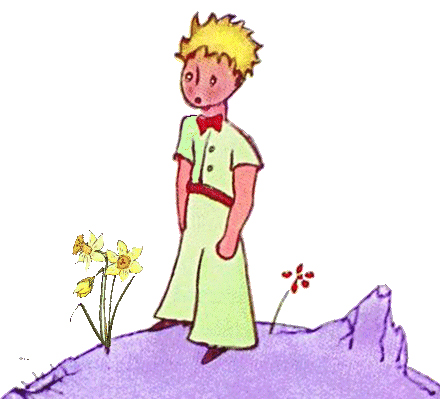

<!-- title : Lab : Draw me a sheep -->
<!-- author : Hubert SABLONNIÈRE -->
<!-- description : Experimenting with canvas and SVG -->
<!-- keywords : javascript, canvas, SVG -->

<link href="../css/bootstrap.min.css" rel="stylesheet">
<link href="../css/bootstrap-responsive.min.css" rel="stylesheet">
<link href="../css/theme-2012-common.css" rel="stylesheet">
<link href="../css/theme-2012-lab.css" rel="stylesheet">
<link href="../css/hljs-github.css" rel="stylesheet">

# Draw me a sheep

<!-- toc -->

Welcome to your new lab, here's the instructions for each exercise :

* Read the lesson entirely!!!!
* Identify your learning goals.
* Understand the context.
* Follow the steps and rules carefully.
* Commit **ONLY** the files that are indicated.

You must try to find documentation and solution by yourself. The course contains links to references and a lot of other interesting websites. Don't forget : the web is your friend ;-)

Bon courage...

## Squares

### Learning goals

1. Know how to use a canvas and draw squares.

### Context

We'll be building a simple drawing tool that can at least draw squares.

### Steps

* Add some event listeners to intercept `mouseup`, `mousedown` and `mousemove` on the `.drawing-canvas` element.
* If you detect a `mousedown` or a `mousemove`, just draw a square of the appropriate color and size centered around cursor position.
* You'll have to retrieve the color input value. Don't get it from the DOM each time you draw, listen to `change` event on the input.
* You'll have to retrieve the size input value. Don't get it from the DOM each time you draw, listen to `change` event on the input.

### Rules

* You **MUST** organize your code into functions...
* **DO NOT** repeat yourself.

### Deliveries

<!-- .deliveries -->
* index.js

## Circles, sheep and eraser...

### Learning goals

1. Know how to draw circle and images on a canvas.
1. Know how to clear something from the canvas.

### Context

In this exercise, we'll add some brushes to our drawing tool.

### Steps

* Add some event listeners to intercept `click` events on the different brushes button. Use event delegation.
* Set the value of the current brush in memory.
* Add some CSS and manipulate the DOM to identify which brush is selected.
* Add some code to draw a circle of the correct size and color at the correct position if circle brush is selected.
* Add some code to draw a sheep at the correct position if sheep brush is selected.
* Add some code to erase a square of the correct size from the canvas if eraser brush is selected.

### Rules

* You **MUST** organize your code into functions...
* **DO NOT** repeat yourself.

### Deliveries

<!-- .deliveries -->
* index.js
* index.css

## Make the desert beautiful

This is a *"be awesome"* exercise!

### Learning goals

1. Go beyond simple tasks using a canvas.

### Context

We already have a simple drawing tool. It's time to push the limits and try unbelivable stuffs. Stuffs that was impossible without flash a few years ago...

### Ideas

* Implement the quick fill algorythm
* Use touch events so it works on tablets.
* Improve the design of the app.
* Draw some cubic bezier curves.
* Import images.
* Copy/cut/paste selections...
* Export to file

### Rules

* You **MUST** organize your code into functions...
* **DO NOT** repeat yourself.

### Deliveries

<!-- .deliveries -->
* index.js
* index.css
