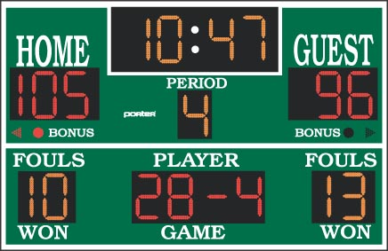

<!-- title : Lab : Scoreboard -->
<!-- author : Hubert SABLONNIÈRE -->
<!-- description : Experimenting with the DOM, create, manipulate, remove, transform... -->
<!-- keywords : javascript, dom, tree, manipulation, json -->

<link href="../css/bootstrap.min.css" rel="stylesheet">
<link href="../css/bootstrap-responsive.min.css" rel="stylesheet">
<link href="../css/theme-2012-common.css" rel="stylesheet">
<link href="../css/theme-2012-lab.css" rel="stylesheet">
<link href="../css/hljs-github.css" rel="stylesheet">

# Scoreboard

<!-- toc -->



Welcome to your new lab, here's the instructions for each exercise :

* Read the lesson entirely!!!!
* Identify your learning goals.
* Understand the context.
* Follow the steps and rules carefully.
* Commit **ONLY** the files that are indicated.

You must try to find documentation and solution by yourself. The course contains links to references and a lot of other interesting websites. Don't forget : the web is your friend ;-)

Bon courage...

#### Unfinished work

Today we'll get ourselves into a real work situation. Improving someone else code without having any indications.

## Filling the blanks

### Learning goals

1. Know how to understand existing code
1. Know how debug step by step
1. Know how to use JavaScript inheritance
1. Know how to use get/set

### Context

The developer prepared listeners in [listeners.js](../labs-files/scoreboard/listeners.js). When an event is fired, he directly modifies the memory representation of the players available on `scoreboard.players`.

In [index.js](../labs-files/scoreboard/index.js), he adds players in memory, but it doesn't add them to the DOM.

Your goal is to code and adapt the object structure of `scoreboard.players` so the direct manipulation of the objects in memory impacts the DOM transparently. It's called data binding.

### Steps

* Add your code in [index.js](../labs-files/scoreboard/index.js).
* Start by finding out how you can execute a function when someone does that :

```javascript
scoreboard.players = [
  {
    id: 'player-2nmeb1pa9csgg008soowg',
    name: 'John',
    score: 42
  },
  /* ... */
]
```

* Iterate over the array an create the different DOM elements. Use the [example-index.html](../labs-files/scoreboard/example-index.html) markup.
* We must be able to call these methods on `scoreboard.players` :

```javascript
scoreboard.players.get('player-2nmeb1pa9csgg008soowg');
scoreboard.players.remove('player-2nmeb1pa9csgg008soowg');
scoreboard.players.sort();
scoreboard.players.put({
  id: scoreboard.getRandomId(),
  name: '',
  score: 0
});
```

* For the last one, you'll need a `scoreboard.getRandomId` function that returns `player-` with some alphanumeric random text. Keep the same lenght as the examples.
* Now you just need to find out how you can execute a function when someone does that :

```javascript
scoreboard.players.get('player-2nmeb1pa9csgg008soowg').name = 'John';
scoreboard.players.get('player-2nmeb1pa9csgg008soowg').score += 1;
scoreboard.players.get('player-2nmeb1pa9csgg008soowg').score -= 1;
scoreboard.players.get('player-2nmeb1pa9csgg008soowg').score = 0;
```

* You'll probably need to add more functions to players like `updateDOM` etc...

### Rules

* You **CANNOT** modify the HTML.
* You **CANNOT** add any event listener.
* You **CANNOT** modify listeners.js.

### Files to edit

<!-- .deliveries -->
* index.js

## Memory

### Learning goals

1. Know how use localStorage

### Context

When you close the page, all the memory is lost.

### Steps

* Use the localStorage to keep the users and their scores in memory.

### Rules

* You **CANNOT** modify the HTML.
* You **CANNOT** add any event listener.
* You **CANNOT** modify listeners.js.

### Files to edit

<!-- .deliveries -->
* index.js

## Adding some style

This is a *"be awesome"* exercise!

### Learning goals

1. Know how to build a fluid design.
1. Know how to make a design that does not suck.

### Context

Have a look at [example-index.html](../labs-files/scoreboard/example-index.html). It doesn't look pretty.

### Steps

* Modify [index.css](../labs-files/scoreboard/index.css).
* Center the page with the margin trick.
* Try to have a usable design for 320px wide screens (smartphones). You can do it without media queries. Have a look at [max-width](https://developer.mozilla.org/en-US/docs/CSS/max-width).
* Add colors, textures, fonts, animations, transitions : just be awesome.

### Rules

* You **CANNOT** modify the HTML.
* Your CSS **MUST** be valid!!

### Files to edit

<!-- .deliveries -->
* index.css

<script src="../js/jquery-1.8.1.min.js"></script>
<script src="../js/bootstrap.min.js"></script>
