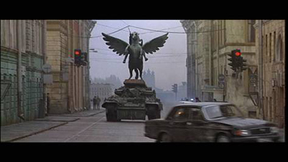

<!-- title : Lab : Think tank -->
<!-- author : Hubert SABLONNIÈRE -->
<!-- description : Experimenting with events (keyboard, mouse) to build a game -->
<!-- keywords : javascript, events, keyboard, mouse, game -->

<link href="../css/bootstrap.min.css" rel="stylesheet">
<link href="../css/bootstrap-responsive.min.css" rel="stylesheet">
<link href="../css/theme-2012-common.css" rel="stylesheet">
<link href="../css/theme-2012-lab.css" rel="stylesheet">
<link href="../css/hljs-github.css" rel="stylesheet">

# Think tank

<!-- toc -->

Welcome to your new lab, here's the instructions for each exercise :

* Read the lesson entirely!!!!
* Identify your learning goals.
* Understand the context.
* Follow the steps and rules carefully.
* Commit **ONLY** the files that are indicated.

You must try to find documentation and solution by yourself. The course contains links to references and a lot of other interesting websites. Don't forget : the web is your friend ;-)

Bon courage...

## Mouse shoot (no jQuery)

### Learning goals

1. Know how to use basic mouse event.
1. Know how to use event delegation.

### Context

This exercise is simple. You have display an explosion when the user clicks on a part of the map.

### Steps

* Have a look at [think-tank.html](../labs-files/think-tank/think-tank.html) DOM. You'll see a `.map` that contains little `.tile` squares.
* Create a file named `mouse-shoot.js` and add some code that detects mouse clicks on the little `.tile` squares.
* Once a `.tile` has been clicked, add a CSS class `explosion` to the element and remove it one second after.

### Rules

* Your code **MUST** use event delegation. If you added 1 listener for each `.tile`, you're doing it wrong.
* You **CANNOT** use jQuery.
* Your code **CANNOT** be global.

### Deliveries

<!-- .deliveries -->
* think-tank.html
* game.css
* map.css
* tank.css
* custom-think-tank.css
* jquery-1.8.2.min.js
* map.js
* mouse-shoot.js
* img/*

## Keyboard move

### Learning goals

1. Know how to use basic keyboard events.
1. Understand game movement, coordinates...

### Context

In this exercise, we'll add moving capabilities to our tank.

Our tank can only go forward and turn left or right. Don't worry, all the trigonometric maths are provided ;-)

### Steps

#### Basic move

* Create a file named `keyboard-move.js` and add some code to detect `left`, `up` and `right` keys. If you're a PGM, maybe `Q`, `Z` and `D` will be better. Maybe you can support both.
* Use the global `thinkTank` object to drive the tank forward (`up` key) and to turn left or right. Look at [game.js](../labs-files/think-tank/game.js) for more details.

#### Better moves

* If you look closer to the DOM, the `.map` is bigger than `.area`. This means sometimes the tank should move and sometimes, the map should move.
* Implement a system that allow that in a smart way. `thinkTank` will help you to know the different size, positions and where the tank is going (with vectors).

### Rules

* You **CAN** use jQuery.
* Your code **CANNOT** be global.
* The map **MUST** always cover all the area.

### Deliveries

<!-- .deliveries -->
* think-tank.html
* game.css
* map.css
* tank.css
* custom-think-tank.css
* jquery-1.8.2.min.js
* map.js
* game.js
* mouse-shoot.js
* keyboard-move.js
* img/*

## Mouse canon

### Learning goals

1. Know how to use complex mouse events and DOM position.

### Context

In this exercise, we'll make the tank turret rotate with the mouse.

### Steps

* Create a file named `mouse-turret.js` and add some code to detect mouse move events.
* Try to find a way to get the coordinates of the tank and of the mouse pointer using the same reference point.
* You have everything you need to retrieve this coordinates with the same reference with `thinkTank`.
* Try to compute the angle in radiants and use the `thinkTank` to rotate the turret.
* The turrent should point to the mouse pointer.

### Rules

* You **CAN** use jQuery.
* Your code **CANNOT** be global.

### Deliveries

<!-- .deliveries -->
* think-tank.html
* game.css
* map.css
* tank.css
* custom-think-tank.css
* jquery-1.8.2.min.js
* map.js
* game.js
* mouse-shoot.js
* keyboard-move.js
* mouse-turret.js
* img/*

## The game

This is a *"be awesome"* exercise!

### Learning goals

1. Experiment with events.
1. Develop new skills.

### Context

It's supposed to be a game. We miss a lot of stuffs :

* Main achievement
* Enemies
* Stuffs that make lose/win points
* Levels

Use whatever you want to make this code base an awesome game.

Because you'll probably need to modify the HTML, use the [think-tank-custom.html](../lab-files/think-tank-custom.html) but don't touch the [think-tank.html](../lab-files/think-tank.html).

### Ideas

* Simultaneous keypress (drive an turn at the same time). Try to find out how and ask if you're lost.
* A secret konami code.
* Customize the map, look at the available images.
* Customize the map, look at the available images.
* Add sounds.
* ...

### Rules

* You **CAN** use jQuery.
* Your code **CANNOT** be global.
* You **CANNOT** use or modify the [think-tank.html](../lab-files/think-tank.html).
* You **MUST** use and/or modify the [think-tank-custom.html](../lab-files/think-tank-custom.html).
* You **CAN** add any CSS, JS or images file you want.
* You **MUST** put the images in the `img` directory and prefix the CSS and JS files by `custom-`.

### Deliveries

<!-- .deliveries -->
* think-tank-game.html
* game.css
* map.css
* tank.css
* custom-think-tank.css
* jquery-1.8.2.min.js
* map.js
* game.js
* mouse-shoot.js
* keyboard-move.js
* mouse-turret.js
* img/*
* custom-*
