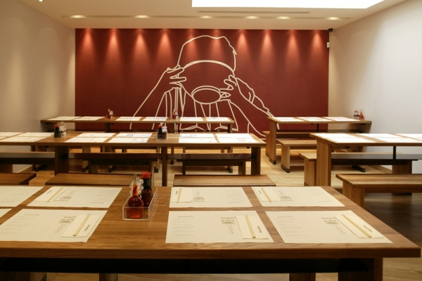

<!-- title : Lab : Wagamama -->
<!-- author : Hubert SABLONNIÈRE -->
<!-- description : Experimenting with tests in JavaScript -->
<!-- keywords : javascript, tests, tdd, unit -->

<link href="../css/bootstrap.min.css" rel="stylesheet">
<link href="../css/bootstrap-responsive.min.css" rel="stylesheet">
<link href="../css/theme-2012-common.css" rel="stylesheet">
<link href="../css/theme-2012-lab.css" rel="stylesheet">
<link href="../css/hljs-github.css" rel="stylesheet">

# Wagamama

<!-- toc -->



Welcome to your new lab, here's the instructions for each exercise :

* Read the lesson entirely!!!!
* Identify your learning goals.
* Understand the context.
* Follow the steps and rules carefully.
* Commit **ONLY** the files that are indicated.

You must try to find documentation and solution by yourself. The course contains links to references and a lot of other interesting websites. Don't forget : the web is your friend ;-)

Bon courage...

#### In the restaurant

Today we'll try to implement something real. We'll develop what waiters use in a restaurant to enter customers orders and make the payment.

#### The tests

To run the tests, you'll need testacular. Look at the course to know how to install it. To run the tests just do this command at the root of the project :

```bash
testacular start test/unit/config.js
```

## The bill please...

### Learning goals

1. Know how to to small unit tests
2. Know how to inherit from an object

### Context

The basic application is almost ready, we need to display the total price of an order.

We'll create a collection that can return the total price of its items.

### What's up in the code doc?

#### [data.js](../labs-files/wagamama/src/wgmm/data.js)

It's a simple declaration of the tables and the different items composing the menu.

#### [view.js](../labs-files/wagamama/src/wgmm/view.js)

The application has three views : table, order and payments. In this file, we set up the listener for the clicks and change the DOM.

You can have a look to the [unit test](../labs-files/wagamama/test/unit/wgmm/view.js) to understand how it works.

#### [priced-collection.js](../labs-files/wagamama/src/wgmm/quantity-collection.js)

In this file, we retrieve a quantity collection object. Like an array it's a collection, you can add and remove items from it. The difference is that if you add an item more than once, it's not duplication. There's only one entry but its quantity is increased.

The same goes when you remove an item from the collection. If there was three item of this kind, removing will decrease the quantity to 2.

You can have a look to the [unit test](../labs-files/wagamama/test/unit/wgmm/quantity-collection.js) to understand how it works.

#### [money.js](../labs-files/wagamama/src/wgmm/money.js)

Money is a really simple utility to format prices to human readable form.

You can have a look to the [unit test](../labs-files/wagamama/test/unit/wgmm/money.js) to understand how it works.

#### [menu.js](../labs-files/wagamama/src/wgmm/menu.js)

The menu is a quantity collection of items. We don't really need the quantity feature but if we were to handle stocks it would be useful.

In this file we set up the DOM modifications according to the contents of the collection. We also handle the clicks on the add buttons.

#### [tables.js](../labs-files/wagamama/src/wgmm/tables.js)

The tables is a quantity collection of table objects. For this, we really don't need the quantity feature but we use put/remove and it works great.

In this file we set up the DOM modifications according to the contents of the collection. We also handle the clicks.

Each table contains a quantity collection representing the items the clients ordered. The quantity feature is really important here.

### Steps

#### TDD: test before

* We're gonna create a `wgmm.pricedCollection` object that inherits from `wgmm.quantityCollection` and add the capability to compute the total price of the collection.
* Create some unit test in [test/unit/wgmm/priced-collection.js](../labs-files/wagamama/test/unit/wgmm/priced-collection.js)
* You must verify that by creating a `wgmm.pricedCollection` and init it with a few items you can call `getTotalPrice()` on it and have the correct value.
* Verify that the quantity is taken into account to compute the total price of the collection.
* Verify that your code fails!

#### TDD: code after

* Create the actual code that passes the tests in [src/wgmm/priced-collection.js](../labs-files/wagamama/src/wgmm/priced-collection.js)
* You only have to inherit and add a function. The code should be very simple.
* You can use `doEach` if you we, it's nice ;-)

#### Integration of into the code

* Modify the [src/wgmm/tables.js](../labs-files/wagamama/src/wgmm/tables.js) file so the total price gets updated in the DOM.
* If you wanna be able to call `getTotalPrice` on an `order`. It shouldn't be a `wgmm.quantityCollection` anymore, it should be a `wgmm.pricedCollection`.
* It should be updated when an item is added or removed.
* Don't forget to set it when a table is selected.

### Rules

* You **MUST** write the tests before the real code.

### Files to edit

<!-- .deliveries -->
* test/unit/wgmm/priced-collection.js
* src/wgmm/priced-collection.js
* src/wgmm/tables.js

## The real thing

This is a *"be awesome"* exercise!

### Learning goals

1. Experiment with unit tests and inheritance.

### Context

Add some kind of payment step : the customer says what he wants to pay, the application displays the price and maybe asks for a credit card.

You just have to remove the items that have been paid by the client.

### Steps

* Feel free to do it how you want...

### Rules

* You **MUST** write the tests before the real code.

### Files to edit

<!-- .deliveries -->
* src/*.js
* test/unit/*.js

<script src="../js/jquery-1.8.1.min.js"></script>
<script src="../js/bootstrap.min.js"></script>
