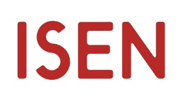
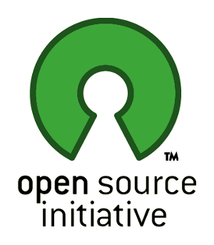

<!-- title : Hubert SABLONNIÈRE -->
<!-- author : Hubert SABLONNIÈRE -->
<!-- description : My really simple web resume. -->
<!-- keywords : history, world-wide-web, browsers -->

<link href="../css/bootstrap.min.css" rel="stylesheet" data-dztheme="article">
<link href="../css/bootstrap-responsive.min.css" rel="stylesheet" data-dztheme="article">
<link href="../css/theme-2012.css" rel="stylesheet">
<link href="../css/theme-2012-common.css" rel="stylesheet" data-dztheme="article">
<link href="../css/theme-2012-article.css" rel="stylesheet" data-dztheme="article">
<link href="../css/theme-2012-presentation.css" rel="stylesheet" data-dztheme="presentation">
<link href="../css/hsablonniere-resume.css" rel="stylesheet" data-dztheme="presentation">

<!-- slide : cover -->

# Hubert SABLONNIÈRE

<!-- toc -->

<!-- slide : illustration -->

## School

<!-- .list.incremental -->

I went to ISEN engineering school from **2004** to **2009**. I was part of the **student body**, responsible for the **student directory**.

<!-- slide : illustration -->

## Work

<!-- .list.incremental -->

I've been working at INEAT Conseil for the past **3+ years**. I've been involved in many **Web Development** projects. I worked in many different contexts : Internet, Extranet and Intranet... This past year I've been involved in mobile projects (**Phone and Tablet**) using web technologies and experimenting with responsive web design.

<!-- slide : illustration -->

## Specialties

<!-- .list.incremental -->

I'm specialized in **Web technologies**. I and have a lot of interest in **user interface** and **user experience** but I'm also experienced in Web architecures and RESTful services.

<!-- slide : illustration -->

## Skills

<!-- .list.incremental -->

On the client side, I love **HTML**, **CSS** and **JavaScript**, it's one of my best skill. On the server side, I have good experience with **Java** and **PHP**, especially with the MVC frameworks like Play! or Symfony. I also have experience with SQL databases such as MySQL and ORMs that goes with it (Hibernate, Doctrine).

<!-- slide : illustration -->

## Side projects

<!-- .long.list.incremental -->

I like creating open-source projects : **[viewports](https://github.com/hsablonniere/prezenta)**, **[YouGo](http://code.google.com/p/ineat-conseil/wiki/YouGo)**, **[readability2pocket](https://github.com/hsablonniere/readability2pocket)**... I also like to contribute to other projects. It can go from simple bug report to full patch submission. I've been seriously involved in **[DZSlides](https://github.com/paulrouget/dzslides)** for more than a year. I also had some really tiny patches accepted or in progress on **[Moment.js](https://github.com/timrwood/moment)**, **[Dillinger.io](https://github.com/joemccann/dillinger)** and **[Play!](https://github.com/playframework)**. Right now, I'm working on a **[Firefox](https://bugzilla.mozilla.org/buglist.cgi?quicksearch=hsablonniere;list_id=4402987)** enhancement.

<!-- slide -->

<!-- .reverse.happy -->
## :-)

<!-- .list.incremental -->
I'm a huge **movie addict** and "**music** was my first love". My favourite font [is](http://www.ironicsans.com/helvarialquiz/) **[Helvetica](http://ilovetypography.com/2007/10/06/arial-versus-helvetica/)**.

<!-- slide -->

<!-- .reverse.unhappy -->
## :-(

<!-- .list.incremental -->
**Klaxons** can get me crazy, as much as **intolerant people**. I hate **[Comic Sans](http://www.comicsanscriminal.com/)**.

<!-- slide -->

## Contact

You can find me on these websites :

<!-- .incremental -->
* [twitter](https://twitter.com/hsablonniere "twitter.picto")
* [email](mailto:hubert.sablonniere+isen@gmail.com "email.picto")
* [github](https://github.com/hsablonniere "github.picto")

