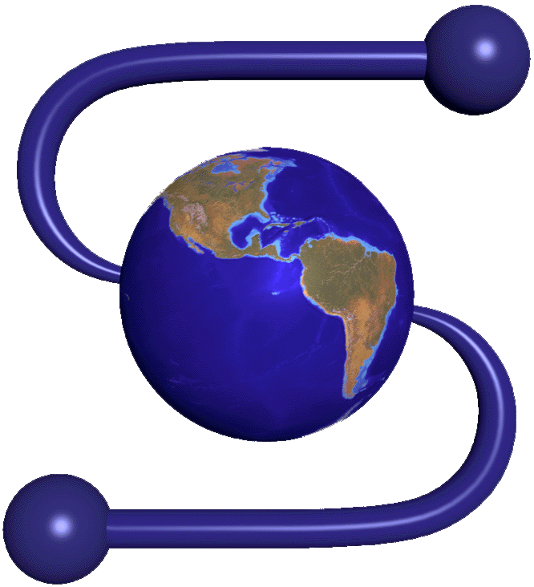
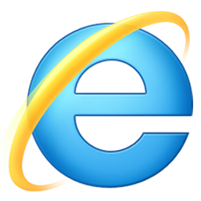

<!-- title : Once upon a time in the Web... -->
<!-- author : Hubert SABLONNIÈRE -->
<!-- description : Quick history of the World Wide Web. From the beginning until now... -->
<!-- keywords : history, world-wide-web, browsers -->

<link href="../css/bootstrap.min.css" rel="stylesheet" data-dztheme="article">
<link href="../css/bootstrap-responsive.min.css" rel="stylesheet" data-dztheme="article">
<link href="../css/hljs-github.css" rel="stylesheet">
<link href="../css/theme-2012.css" rel="stylesheet">
<link href="../css/theme-2012-common.css" rel="stylesheet" data-dztheme="article">
<link href="../css/theme-2012-article.css" rel="stylesheet" data-dztheme="article">
<link href="../css/theme-2012-presentation.css" rel="alternate stylesheet" data-dztheme="presentation">
<link href="../css/once-upon-a-time-in-the-web.css" rel="alternate stylesheet" data-dztheme="presentation">

<!-- slide : cover -->

# Once upon a time in the Web...

<!-- toc -->

<!-- slide -->

## The world wide web!

What is the world wide web? Basically it's a giant network of pages and resources identified and linked thanks to URLs. The Web is one application of the Internet. You should make the difference between the two, they're not the same. Internet existed long before. It was already used to do email, chat etc...

<!-- .list.incremental -->
Let's see how it works. When you visit a regular web site it's a 2-step action. Your **web browser** sends an **HTTP request** through the **Internet** to a web server. The **web server** sends back an **HTTP response** to the web browser. This response is a **web page** and may contain **HTML, CSS and JavaScript**. Many other types of multimedia resources can be served. Let's how the web became was it is today!

<!-- slide : illustration -->

## A long time ago...

<!-- .list.incremental -->
**Tim Berners-Lee**  while working at **CERN** invented the **World Wide Web** around **1990**. The Internet was already here but not from much. He created the HyperText Transfer Protocol (**HTTP**), the HyperText Markup Language (**HTML**), the **first web browser** (WorldWideWeb) and the **first web server** (CERN HTTPd) using a NeXTcube computer. His colleague Robert Cailliau helped him during this historical period.

<!-- slide : cover -->

## The early web browsers

<!-- slide : illustration -->

### Mosaic

<!-- .list.incremental -->

Released in **1993**, Mosaic was **one of the first popular** web browser for general public thanks to its clean graphical user interface. It was originally designed and programmed by **Marc Andreessen** and **Eric Bina** for National Center for Supercomputing Applications (**NCSA**). First version supported Unix's X Window System. Windows and Macintosh ports came just after.

<!-- slide : illustration -->

### Netscape navigator

<!-- .list.incremental -->

**Marc Andreessen** then co-created Mosaic Communications which was quickly renamed **Netscape Communications** for legal issues. The company released the first version of Netscape navigator in late **1994**. Even if Marc developed Mosaic, Netscape was developped **from scratch**. Internal name of Netscape navigator was **Mozilla : "Mozaic Killer"**.

<!-- slide : illustration -->

## W3C

<!-- .list.incremental -->

It's a **standard organization** founded by **Tim Berners-Lee** in **1994** after he left the CERN. It was created to ensure long term growth of the Web and its standards. W3C currently manages specifications for **HTML, XHTML**, **XML**, **CSS**, **PNG, SVG**...

<!-- slide : illustration -->

## CSS

<!-- .list.incremental -->
At the time, web presentation possibilities were thin. The idea to **separate structure from presentation** was a need. In the end of 1994, **nine stylesheet languages** were proposed to the **W3C mailing list**. **Two were chosen** as the foundation of what would become CSS. **Håkon Wium Lie**  who currently works for Opera Software proposed CHSS and **Bert Bos** proposed Stream-based Style Sheet Proposal (SSP). The two worked together and by the end of **1996**, CSS was ready to become official.

<!-- slide : illustration -->

## JavaScript

<!-- .list.incremental -->
In **1995**, **Brendan Eich**  developped the language for **Netscape Communications**. The project name changed twice : **Mocha then LiveScript** and then JavaScript (because of Sun Microsystems partnership with Netscape). JavaScript is **not related to Java!**In November 1996, Netscape submitted JavaScript to **Ecma International**, a standard organization. Work resulted in the standardized version named **ECMAScript**.

<!-- slide : cover -->

## Current web browsers

<!-- slide : illustration -->

### Internet explorer

<!-- .list.incremental -->

In 1994, **Microsoft** aquired NCSA **Mosaic source code** (property of Spyglass). They modified it, renamed it to Internet Explorer and released it in august **1995**. Thanks to windows market share IE won the first browser war and reached **95% of users in 2002**. They developped their own rendering engine known as **Trident** and the latest version of the javascript engine is called **Chakra**.

<!-- .list.incremental -->
Microsoft invented the **iframe in 1997**. Use it carefully.

<!-- .list.incremental -->
As part of Outlook Web Access, Microsoft originally created the **XMLHttpRequest in 2000**, needed for every AJAX call.

<!-- slide : illustration -->

### Opera

<!-- .list.incremental -->

In **1996**, **Opera software** released the first public version (2.0) of Opera. Opera is known for its **focus on standards**. Their rendering engine **Presto** and their javascript engine **Carakan** are home made and proprietary. It suffered from an **add banner until 2005**. Opera never had a big market share on desktops but was one of the early actors on **mobile phones**, before the smartphone apps era. It is more of an **internet tool suite**, it includes an email client, a BitTorrent client, an IRC client...

<!-- slide : illustration -->

### Safari

<!-- .list.incremental -->

On January **2003**, **Apple** announced Safari 1. It **uses WebKit** the rendering engine of KHTML. Their JavaScript engine is called **Nitro**. In 2007, the company made a mobile version of their own browser for the **iPhone platform**. Safari desktop doesn't have a huge market share. Even if they released a **windows version in 2007**, they rely on the mac population.

<!-- slide : illustration -->

### Firefox

<!-- .list.incremental -->

In 2003, the netscape-affiliated Mozilla Organization founded the **Mozilla Foundation**. They released the first version of Firefox in **2004**. Firefox was first meant to be called **Phoenix and then Firebird** but other companies owned thoses names. Firefox was simply a safe, unique and cool-sounding option. The rendering engine is called **Gecko** and was developped way before the mozilla adventure. The JavaScript engine **SpiderMonkey** is actually the first one written by Brendan Eich himself. It has been updated since. Firefox is probably the more famous **open-source** application out there.

<!-- .list.incremental -->
Firefox owns the most downloaded app record (more than **8 million in 24 hours**) for Firefox 3.

<!-- slide : illustration -->

### Chrome

<!-- .list.incremental -->

In September **2008**, **Google** released Chrome for Windows. **In 2010, Linux and MacOS** were released as stable versions. Google **uses WebKit** rendering engine. They tried to reassure web developers that if it worked on Safari it would work on Chrome. Their major arguments are speed with their **V8** JavaScript engine and a **minimalistic UI**. The project is based on the **open source** chromium project they created at the same time.

<!-- slide : title link -->

## Evolution of Web

[Interactive map](http://evolutionofweb.appspot.com/?hl=en)

